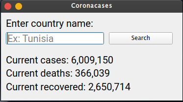

# coronavirus-gui
A simple GUI application that allows you to see the current confirmed cases, deaths and recovered cases. 
You simply type in a country's name, and voila!

This uses PySide2 for GUI and BeautifulSoup to get data from the web.

